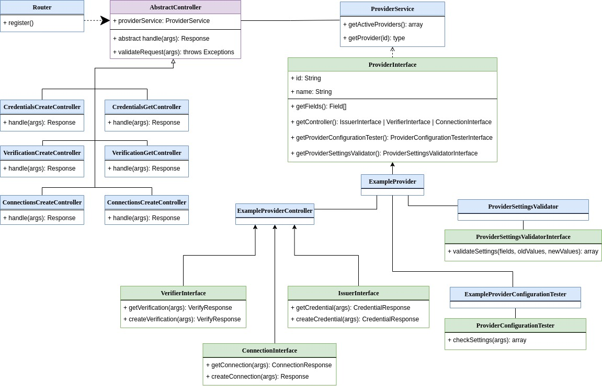

# Interoperability Plugin Development

The following steps describe what is needed to implement a new “Interoperability Plugin”, to support new services for the WordPreSSI Login plugin. To help development, we created a “skeleton” code called ExampleProvider, which implements all the interfaces needed to operate a new service.

1. Create a new folder containing the name of the provider (for now on **NewProvider**).
   Obviously the fastest way is to duplicate the folder */inc/Providers/ExampleProvider* and rename it with the name of the new provider.
1. The next step is to refactor the Namespace and the class of interest replacing *ExampleProvider* with *NewProvider* (or the name of choice)
1. In order to display the new Provider in the admin area menu, a new instance must be added in the *‘inc/Services/ProviderService.php’* Class.
   To do so, please add it in the function ‘*getProviders()’.*
1. Check that the provider appears in the Admin area Menu under the ‘SSIPlugin’ entry.
1. The next step is to configure the plugin fields provided by the Provider Interface. To do so, customize your provider class *‘inc/Providers/NewProvider.php’* defining the properties:
   1. **id**
      this property represent the id of your provider and is expressed as ‘ssi\_newProviderId’
   1. **name**
      the name of your provider, displayed on the admin menu, on the provider settings page and in the login page
   1. **getFields**()
      This function returns the list of fields that will be displayed on the provider settings page and that are used to configure the provider itself.
      There are two kinds of fields that can be used: ‘TextField()’ to store string values/settings and ‘CheckBoxField()’ to store boolean values/settings (1 = true, null/0 = false).
1. Implement the **getProviderSettingsValidator**() function
   The function is used to return an instance of a ‘*ProviderSettingsValidatorInterface’*. 
   A class implementing this interface is needed to validate the settings specified for the provider. This ensure that all the required fields, for example, are filled and so on. deally a message for each invalid field is returned with a proper message.
   The class is executed when the administrator clicks the ‘Save’ button on the provider settings page.
1. Implement the **getProviderConfigurationTester**() function
   The function is used to return an instance of a ‘*ProviderConfigurationTesterInterface*’. 
   A class that implements the interface exposes a function used to check the configuration of a given provider.

This ensures that all the settings specified for a provider (the value of the fields) are valid and can be used. This function should be used to understand, for example, if the api token is valid, if the credentials mapping is correct or if the api endpoint is reachable. Ideally an associative array mapping the array with the first error with the invalid field and an explanation.

1. Implement the **getController**() function
   The function returns a class implementing (one, or a subset) of the interfaces  ‘*VerifierInterface*’, *‘IsuerInterface’* and *‘ConnectionInterface’*. The Interfaces to implement in the ‘*NewProviderController.php*’ class depends on the functionality of the provider: if the provider acts only as verifier and issuer then only the VerifierInterface and IssuerInterface must be implemented.
   The next steps of this list must therefore be followed only for the functionalities that the provider supports.
1. Sign-Up Functionality - **IssuerInterface**
   In order to support the Sign-Up functionality the ‘*NewProviderController.php*’ must implement the *IssuerInterface*. The interface exposes two different methods: ‘*createCredential($args)*’ and ‘getCredential($args)’.
   The two methods take as argument an associative array ($args) where are stored the provider settings (eg if the provider has a field 'apikey' accessing the $args['apikey'] will return the value of the settings, in this case the Api Key), and the data sent from the request. These two Methods return an instance of the ‘Inc/Responses/CredentialResponse.php’ class.
   1. NewProviderController::**createCredential($args)**: this function is called when the user clicks on the 'SignUp' button. Is used to create a connection and return back in the response an ‘offerUrl’ (a link) that is converted in a QR-Code.
      If the response specifies ‘pollingIssue’ as ‘nextAction’ then the client will start the polling phase calling the getCredential function with a fixed interval.
   1. NewProviderController::**getCredential($args)**: this function is called during the 'pollingIssue' phase. This phase is necessary to understand if the qr-code has been displayed, has been scanned and if the credential has been created. A response with the ‘status’ property set to ‘offered’ means that the qr-code has been displayed but the user has not interacted with it yet. A response with the ‘status’ property set to ‘Issued’ means that the credential has been issued and the polling phase ends.
      If you need to obtain the information regarding the status of the credential while maintaining some sort of state between different API calls, you can use the ‘*CredentialResponse::setArgs($args)*’ method. 
      The special 'args' key is used to maintain information during different polling calls: the values passed to the ‘setArgs()’ function are transferred back in the next polling call. (eg. If you return as result of the *getCredential* a *CredentialResponse* with the *‘args’* property set to ‘['some-key' => 'someValue']’, then in the next pollingCall to the *getCredential*, accessing the ‘*$args['args']*’ will produce the previous value ‘ [*'some-key' => 'someValue']* ‘
1. ` `Login Functionality - **VerifierInterface**
   In order to support the Login functionality the ‘*NewProviderController.php*’ must implement the *VerifierInterface*. The interface exposes two different methods: ‘*createVerification($args)*’ and ‘getVerification($args)’.
   The two methods take as argument an associative array ($args) where the provider settings and the data sent from the request are stored (as explained for the IssuerInterface). These two Methods return an instance of the ‘Inc/Responses/VerificationResponse.php’ class
   1. NewProviderController::**createVerification($args)**: this function is called when the user clicks on the 'Login’ button and is usually used to create a connection and return back in the response an ‘offerUrl’ with a valid link that is converted in a QR-Code. 
      If the response specifies ‘pollingVerify’ as ‘nextAction’ then the client will start the polling phase calling the getVerification function with a fixed interval.
   1. NewProviderController::**getVerification($args):** this function is called during the 'pollingVerify' phase. This phase is necessary to understand if the qr-code has been displayed, has been scanned and if the credential has been verified. A response with the ‘status’ property set to ‘offered’ means that the qr-code has been displayed but the user has not interacted with it yet. A response with the ‘status’ property set to ‘Accepted’ means that the credential has been issued and the polling phase ends. If you need to obtain the information regarding the status of the credential while maintaining some sort of state between different API calls, you can use the ‘*VerifyResponse::setArgs($args)*’ method. 
1. Finally, in order to make the plugin available to the users you need to activate it: go to the Wordpress Admin area and access the WordPreSSI Plugin settings page. Find your provider and activate it.

## Class Diagram

In this section is displayed a class diagram with the primary classes and interfaces.

