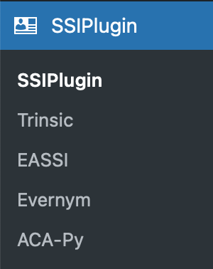
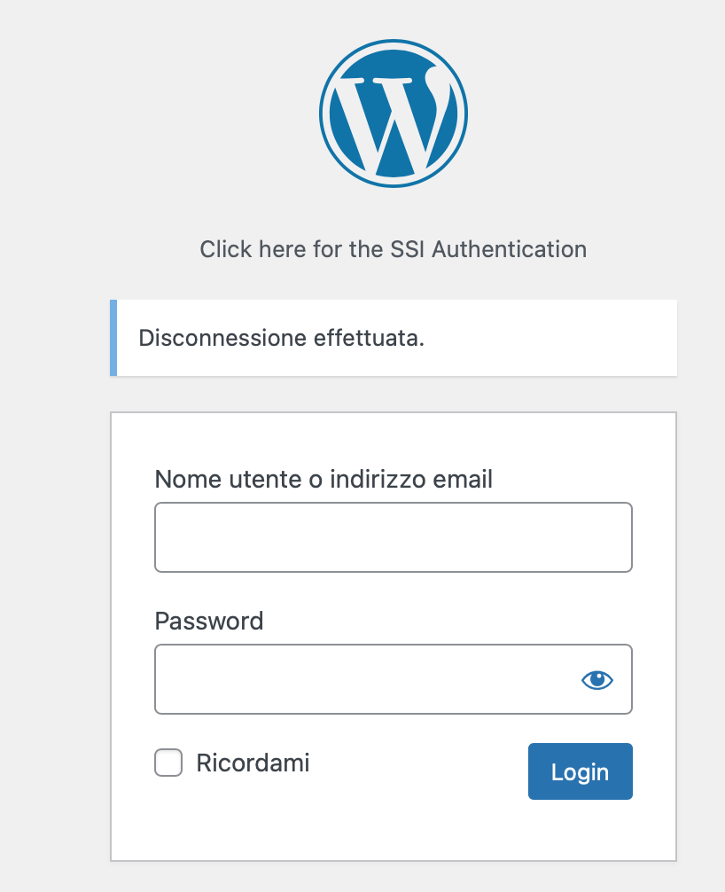
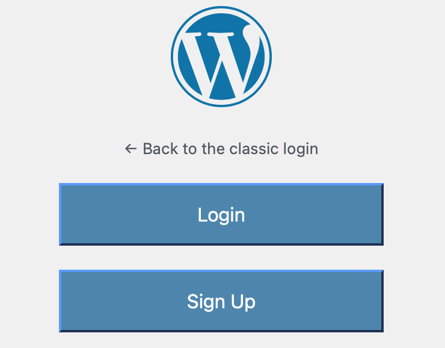
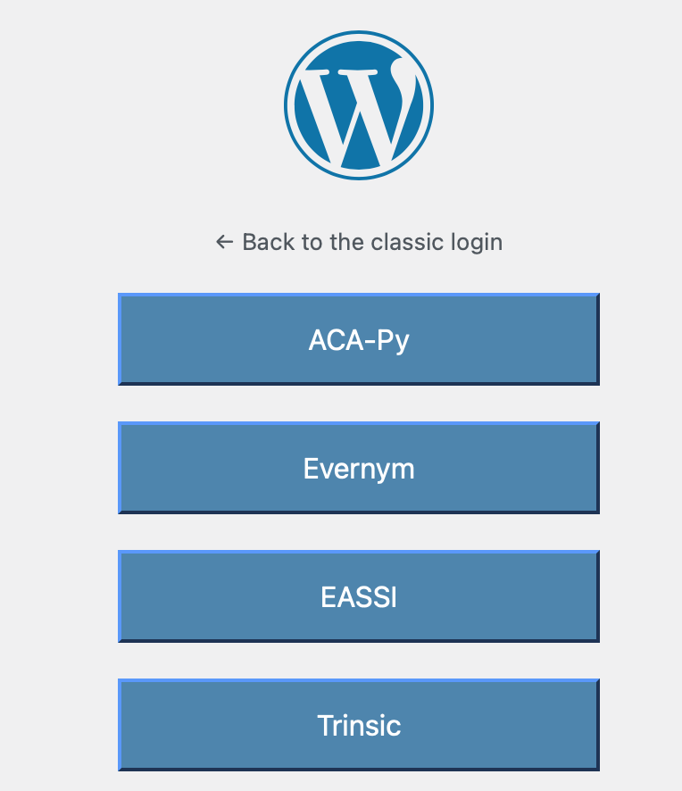

# WordPreSSI User Manual

## Introduction

The WordPreSSI Login Plugin enables the possibility of using Self Sovereign Identity by logging into WordPress sites using Verifiable Credentials. The plugin can also act as an issuer of credentials, for the services that support it.

The plugin is installed simply by copying the SSIPlugin folder to the "wp-content/plugins" folder of the WordPress Installation. 
After Activation, the Administrator must enable and configure the services. 

Please refer to the document "Provider implementation v1.0" for further information. 

After installation, the plugin provides an additional link to the WordPress login page: "Click here for the SSI Authentication".

## Signup

The plugin can work with an already existing credential, but can also act as an issuer of credentials. The claims which are needed are an "Identifier", which is a unique value corresponding to the userid of the site, and a "Role", which is currently only used as a reference, because the role information in WordPress is stored in the mysql database. 
As a demonstration feature, when an user asks to signup, a credential is issued with a random identifier as the Identifier and a Role corresponding to the current setting of the "Default role for new users" value in the "General settings" page of WordPress. The default value for this role is "Subscriber". 
The names of the claims to be used as the "Identifier" and the "Role" can be configured by th user.

## Login

After obtaining a credential, a user can login to the site by first choosing the service:

then scanning the QR Code: 

and if the credential is valid, the user will be logged in.

## Other Administration options

The Trinsic service features also the "shortcode" option, which enables users to display a QRCode for connecting to the identity of the site.

The EASSI Service features also the "Debug" option, in order to display a page with the details of the token provided by the service after login or signup.

## Shortcode

The feature is available currently on the Trinsic provider. When editing a page or article, it is possbile to add the following block:

[ssiconnection provider="ssi_trinsic"]

to display a shortcode for creating a connection to the identity of the site.

